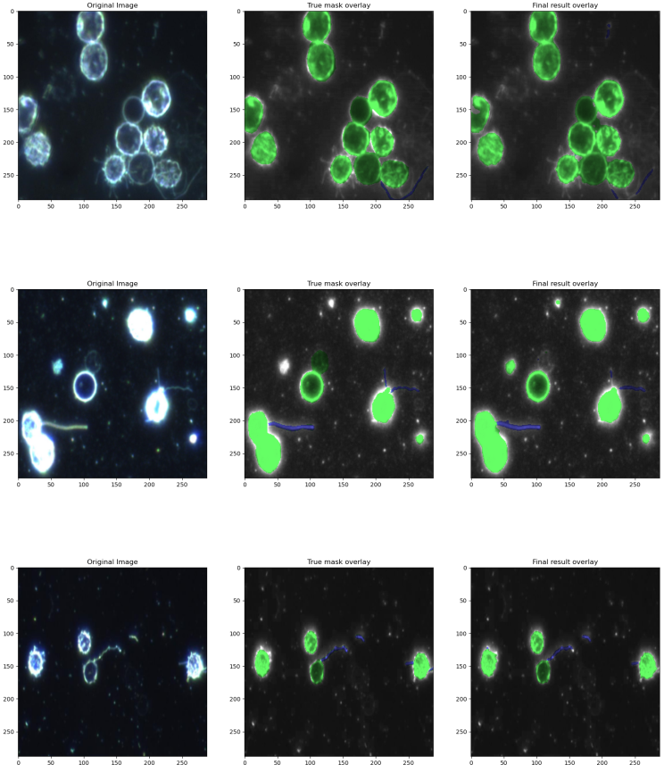
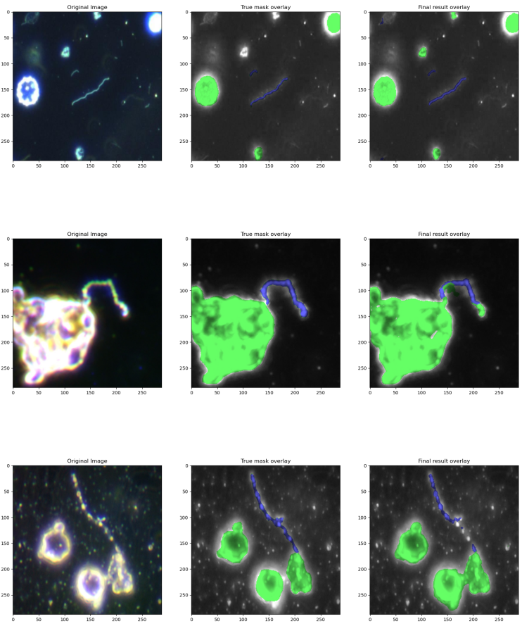

# Univr Ml & Ai
 Dataset - https://www.kaggle.com/longnguyen2306/bacteria-detection-with-darkfield-microscopy 

# Setup

- cp .env.example .env (use to setup some variable)
- put your kaggle api settings inside .env (KAGGLE_USERNAME and KAGGLE_KEY). This is used to download the dataset
  automatically. Login in into Kaggle -> your profile -> account. From here under "Api" section click
  "Create new API token" button. 
  
# Report
In the **pdf_report** folder you can find a detail report for the project. We encourage you to take a look

#  Result

# Tensorboard

python -m tensorboard.main --logdir=S:\train_data\logs --host=127.0.0.1 --port 6006 // change logdir based on env
variable TRAIN_DATA

# Package

- kaggle
- albumentations
- segmentation model - pip install -U segmentation-models

